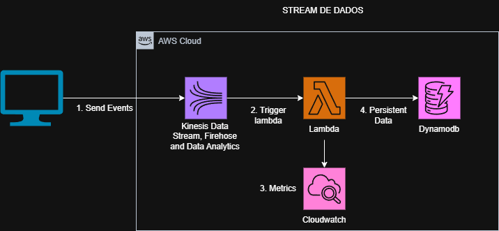

# Projeto de Processamento de Dados em Tempo Real com AWS Kinesis, Lambda, DynamoDB e Terraform

Este projeto demonstra como ingerir dados em tempo real usando o **Amazon Kinesis Data Streams**, processá-los com uma função **AWS Lambda** e armazenar os resultados no **Amazon DynamoDB**. Toda a infraestrutura necessária é gerenciada de forma automatizada utilizando **Terraform**.

## Topologia



## Arquitetura

A arquitetura do projeto consiste nos seguintes componentes:

- **Kinesis Data Streams**: Um serviço de streaming da AWS que coleta e processa dados em tempo real. Ele é responsável por ingerir eventos como logins, compras e outras interações de usuários.
  
- **AWS Lambda**: Uma função serverless que é acionada automaticamente sempre que novos dados chegam ao Kinesis. A função realiza a transformação dos dados e os insere no DynamoDB.

- **DynamoDB**: Um banco de dados NoSQL altamente escalável, usado para armazenar os eventos processados pela função Lambda.

- **Terraform**: Ferramenta de infraestrutura como código para gerenciar e provisionar automaticamente todos os recursos da AWS.

## Requisitos

Para executar esse projeto, você precisa dos seguintes itens:

- **AWS CLI** configurado com credenciais válidas.
- **Terraform** instalado em sua máquina.
- **Boto3** e **AWS SDK** configurados no ambiente Lambda (já incluídos no ambiente de execução padrão da AWS Lambda).

## Como usar

### 1. Clone o repositório

```bash
git clone <URL do repositório>
cd <diretório do projeto>
```

### 2. Inicializar o Terraform

Antes de aplicar o Terraform, inicialize o projeto e baixe os plugins necessários:

```bash
terraform init
```

### 3. Criar os recursos na AWS

Depois de inicializar, você pode aplicar a configuração do Terraform para criar a infraestrutura:

```bash
terraform apply
```

O Terraform irá criar:

- O **Kinesis Data Stream** chamado `Ingestion-Workshop`.
- A **função Lambda** que processa dados do Kinesis e os armazena no DynamoDB.
- A tabela **DynamoDB** chamada `workshop_events`.

### 4. Implantar a função Lambda

Se você desejar atualizar ou modificar o código da função Lambda, basta editar o arquivo `lambda_function.py` e fazer o upload novamente através do console da AWS ou usando a AWS CLI.

### 5. Testando o fluxo

Com a infraestrutura implantada, o Kinesis começa a ingerir dados de exemplo. A função Lambda é acionada sempre que novos dados são enviados, transformando-os e armazenando-os na tabela DynamoDB.

### 6. Visualizar os dados no DynamoDB

Após o processamento, você pode visualizar os itens na tabela DynamoDB `workshop_events` para verificar os eventos que foram processados e armazenados.

## Estrutura do Projeto

A estrutura do projeto é a seguinte:

```
/WORKSHOPSENAI-53
  ├── src
  │   ├── Lambda-Function          # Repositorio da função lambda
  │   │  ├── lambda_function.py    # Código da função Lambda
  ├── template                     # Diretório com os arquivos Terraform
  │   ├── modules                  # Diretorio com os modulos do terraform                     
  │   ├── provider.tf              # Definição dos recursos Terraform
  │   ├── var.tf                   # Variáveis do Terraform
  │   └── version.tf               # Versão do Terraform
  └── README.md                    # Este arquivo de documentação
```

## Contribuição

1. Fork o repositório.
2. Crie uma nova branch (`git checkout -b feature-xyz`).
3. Faça suas mudanças e commit (`git commit -am 'Adiciona nova feature'`).
4. Push para a branch (`git push origin feature-xyz`).
5. Abra um Pull Request.

## Contato

Se você tiver dúvidas ou precisar de mais informações, fique à vontade para entrar em contato!

---

### **Observações**

- Caso o Terraform precise ser destruído (remover os recursos), use o comando:

```bash
terraform destroy
```